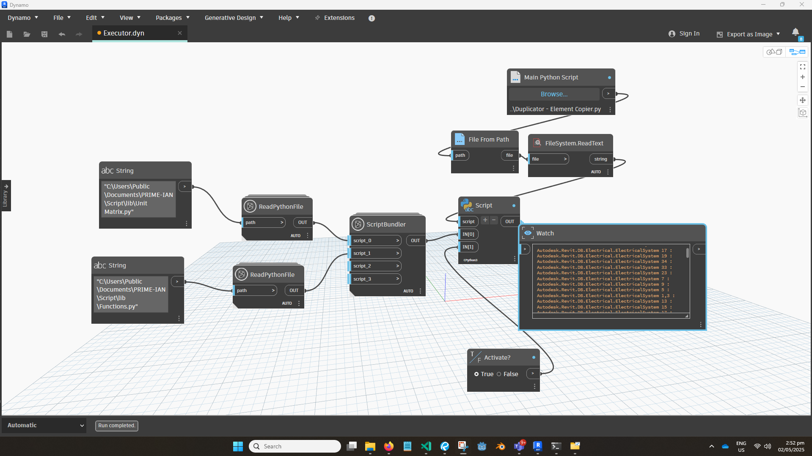

# Revit API Custom Scripts

The following Python scripts connect to the Revit API. I developed them in my current role as a BIM Modeller to automate tasks for a high-rise building project that involves many typical units and redundant views.

Because of the repetitive nature of my work, I used a Dynamo script to load these Python scripts. The image below shows how I used a “script bundler” custom node to share common code across all of my Python scripts.

